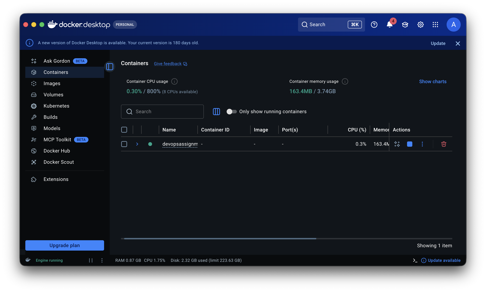
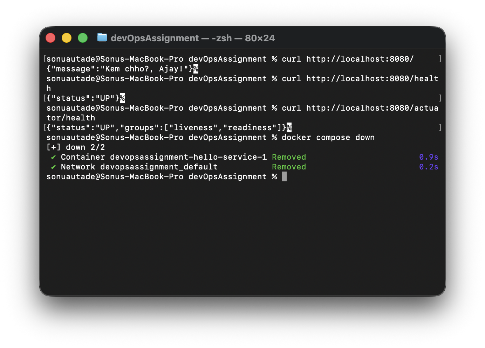
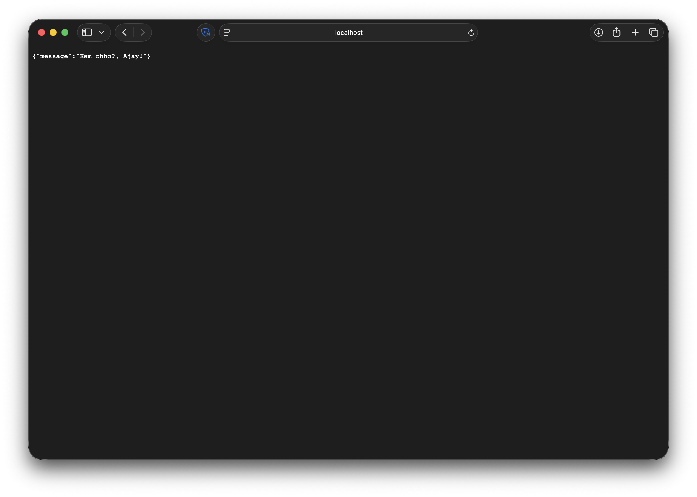
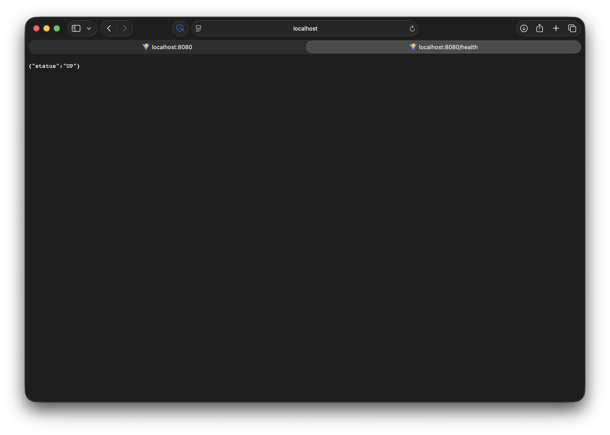
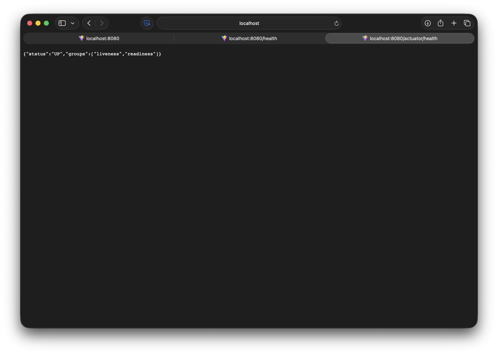

# Spring Boot Docker Assignment

Hey! Here is my solution for the DevOps assignment. I've containerized the Spring Boot service using a multi-stage Dockerfile and wired everything up with Docker Compose.

---

## How to Run & Test

Everything runs through Docker Compose with a single command:

```bash
docker compose up --build -d
```

Give it about 15-20 seconds for Spring Boot to start up, then check the endpoints:

```bash
# 1. Main greeting endpoint (configured via env variables)
curl http://localhost:8080/
# Output: {"message":"Kem chho?, Ajay!"}

# 2. App health endpoint
curl http://localhost:8080/health
# Output: {"status":"UP"}

# 3. Actuator health endpoint
curl http://localhost:8080/actuator/health
# Output: {"status":"UP","groups":["liveness","readiness"]}
```

To verify the container is healthy:
```bash
docker compose ps
# STATUS should show "(healthy)"
```

To stop everything:
```bash
docker compose down
```

---

## Verification Screenshots

All tests and screenshots below were taken directly on my local setup (**macOS / Apple Silicon**):

### 1. Docker Desktop — Container Running
Shows the container running healthy in Docker Desktop for Mac:



### 2. Terminal Curls & Verification
Terminal session on macOS running the curl commands against all 3 endpoints and testing `docker compose down`:



### 3. Root Endpoint (`/`) in Browser
Testing the main greeting endpoint in Safari returning `{"message":"Kem chho?, Ajay!"}`:



### 4. Healthcheck Endpoint (`/health`) in Browser
Testing the custom `/health` endpoint in Safari returning `{"status":"UP"}`:



### 5. Actuator Health Endpoint (`/actuator/health`) in Browser
Testing Spring Boot Actuator in Safari returning `{"status":"UP","groups":["liveness","readiness"]}`:



---

## Submission Notes

### Testing Environment & Image Size
I tested and ran this entire setup locally on **macOS (Apple Silicon / M-series Mac)**.

- **Final Image Size:** `~409 MB`
- **Base Image Used:** `eclipse-temurin:17-jre-jammy`

**Why 409 MB instead of ~100 MB?**
Initially, I planned to use Alpine (`eclipse-temurin:17-jre-alpine`) which brings the image down to around 90-100 MB. However, when building on my Mac, the Alpine JRE image threw architecture/platform compatibility errors on ARM64. To make sure it builds and runs smoothly on macOS without hacks, I used the Ubuntu-based slim JRE (`jammy`). If this is deployed on standard x86/amd64 Linux servers in CI/CD or production, swapping the base image back to `17-jre-alpine` will immediately drop the size to ~100 MB.

### How I Kept the Image Lean
1. **Multi-Stage Build:** The heavy stuff (Maven, source files, dependencies downloaded during build) only lives in stage 1 (`build`). The final image only gets the compiled `hello-service.jar`.
2. **JRE instead of full JDK:** A full JDK image has compilers and dev tools that take up 800MB+. I only used the runtime JRE for stage 2.
3. **Layer Caching:** In the Dockerfile, I copy `pom.xml` first and run `mvn dependency:go-offline` before copying the `src/` folder. This way, if you change application code, Docker doesn't re-download all the Maven dependencies from scratch.
4. **`.dockerignore`:** Added this to ignore local `target/`, git files, and IDE folders so Docker doesn't waste time uploading junk into the build context.

### Security & Other Details
- **Non-Root User:** Added an `appuser` group and user in the Dockerfile so the app doesn't run as root.
- **Healthchecks:** Added a healthcheck in both `Dockerfile` and `docker-compose.yml` pinging `/health`. Compose waits with a start period so Spring Boot has time to boot before checks begin.
- **Config via Environment:** Port, greeting, and name are not hardcoded in code or Dockerfile. They're passed through compose / `.env` (`GREETING="Kem chho?"`, `NAME="Ajay"`).

### Things I Would Do With More Time
- **Try jlink:** Could use Java's `jlink` tool to strip out unused Java modules and package a custom minimal JRE. That could shave off another 30-40 MB.
- **GraalVM Native Image:** Turning this into a Spring Boot native image would bring the size down to ~50 MB and start up in milliseconds, though it takes longer to compile.
- **Production Secrets:** For a real prod deployment, I wouldn't store sensitive env values in plain text files—I'd hook this up to Docker secrets or a secret manager.
- **Resource Limits:** In a cluster or shared server, I'd add CPU and memory limits (`limits: cpus: '0.5', memory: 512M`) in the compose file to prevent memory leaks from crashing the host.
